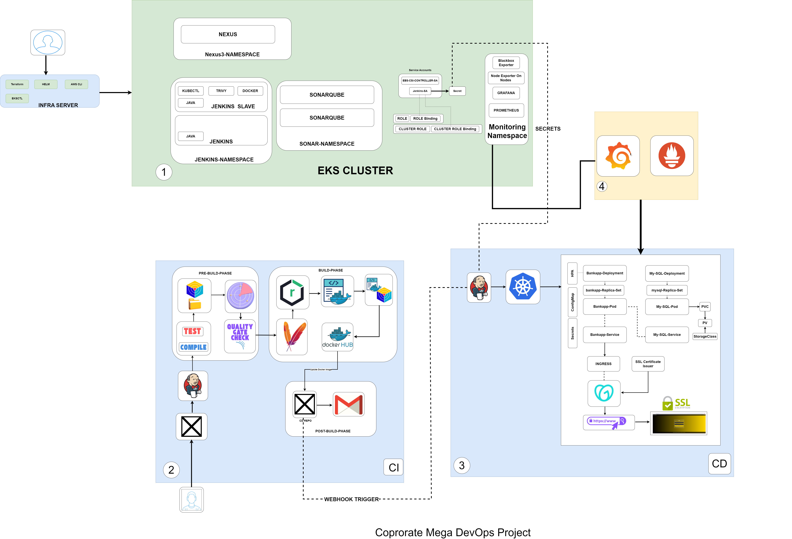

# 🚀 End-to-End DevSecOps CI/CD Platform on AWS EKS

## 📌 Présentation du projet

Ce projet implémente une **plateforme DevSecOps complète** basée sur AWS et Kubernetes.

Il automatise tout le cycle de vie applicatif :

* Infrastructure as Code (Terraform)
* Intégration Continue (Jenkins CI)
* Déploiement Continu (Jenkins CD + GitOps)
* Conteneurisation (Docker)
* Sécurité (Trivy + SonarQube)
* Gestion des artefacts (Nexus)
* Orchestration Kubernetes (Amazon EKS)
* Observabilité (Prometheus + Grafana)
* Gestion du trafic (Ingress + Cert-Manager)
* Auto-scaling (HPA)

---

## 🏗️ Architecture



# 🏗️ Architecture globale

```text id="a1k9dp"
Développeur
   ↓
GitHub (CI Repository)
   ↓
Jenkins CI Pipeline
   ↓
Maven Build + Tests
   ↓
SonarQube Analysis
   ↓
Trivy Security Scan
   ↓
Nexus Repository
   ↓
Docker Build
   ↓
Docker Hub
   ↓
Mise à jour GitOps Repo
   ↓
GitHub (CD Repository)
   ↓
Jenkins CD Pipeline
   ↓
Amazon EKS Cluster
   ↓
Ingress Controller
   ↓
Monitoring (Prometheus + Grafana)
```

---

# ☁️ Infrastructure AWS (Terraform)

## Ressources créées

* VPC (10.0.0.0/16)
* Subnets publics multi-AZ
* Internet Gateway
* Route Tables
* Security Groups
* IAM Roles
* Amazon EKS Cluster
* EKS Managed Node Group (3 x t2.medium)
* AWS EBS CSI Driver

## Déploiement

```bash id="t8k2dp"
terraform init
terraform plan
terraform apply
```

## Suppression des ressources

```bash id="d9k2dp"
terraform destroy
```

---

# ⚙️ CI/CD Pipeline (Jenkins)

## 🔵 Pipeline CI (Continuous Integration)

Étapes :

* Checkout GitHub
* Compilation Maven
* Tests unitaires
* Analyse SonarQube
* Quality Gate
* Scan sécurité Trivy (filesystem)
* Build artifact Maven
* Déploiement Nexus
* Build image Docker
* Scan image Docker
* Push Docker Hub
* Mise à jour manifest GitOps

---

## 🟢 Pipeline CD (Continuous Deployment)

Étapes :

* Checkout repository CD
* Application des manifests Kubernetes
* Déploiement sur EKS
* Déploiement HPA (autoscaling)

---

# 🐳 Docker & GitOps

* Images Docker générées automatiquement par Jenkins
* Push vers Docker Hub
* Mise à jour automatique du tag dans `manifest.yaml`
* Déploiement déclenché via GitOps

---

# ☸️ Kubernetes (Amazon EKS)

## Cluster

* Cluster managé AWS EKS
* 3 nœuds worker (t2.medium)
* Déploiement multi-AZ

## Add-ons Kubernetes

* AWS EBS CSI Driver (storage)
* NGINX Ingress Controller
* Cert-Manager (TLS)

---

# 📦 Manifests Kubernetes (CD Repo)

## Fichiers

```text id="m1k9dp"
manifest.yaml   → Deployment + Service
HPA.yaml        → Autoscaling horizontal
ingress.yaml    → Exposition externe
ci.yaml         → Configuration CI/CD
```

## Fonctionnement

* `manifest.yaml` déploie l’application
* `HPA.yaml` gère le scaling automatique
* `ingress.yaml` expose l’application via HTTP/HTTPS
* `ci.yaml` supporte GitOps / Jenkins

---

# 📦 Helm & Outils Kubernetes

## Outils installés

* kubectl
* eksctl
* Helm

## Connexion au cluster

```bash id="k8k2dp"
aws eks --region us-east-1 update-kubeconfig \
--name devopsshack-cluster
```

---

# 📊 Monitoring (Prometheus + Grafana)

Déployé avec Helm (`kube-prometheus-stack`)

## Composants

* Prometheus (metrics)
* Grafana (dashboards)
* Node Exporter
* Kube State Metrics

## Installation

```bash id="p2k9dp"
helm repo update

helm upgrade --install monitoring \
prometheus-community/kube-prometheus-stack \
-f values.yaml \
-n monitoring --create-namespace
```

---

## Accès

* Grafana : LoadBalancer AWS
* User : `admin`
* Password : `admin123`

---

# 📈 Observabilité

Métriques collectées :

* CPU / Memory usage
* Pod health
* Node health
* Restart count
* Cluster performance
* Network traffic

---

# 🔐 DevSecOps (Sécurité)

Ce projet intègre :

* SonarQube → qualité du code
* Trivy → scan sécurité images + filesystem
* IAM AWS → accès sécurisé
* Kubernetes RBAC
* Cert-Manager → HTTPS/TLS

---

# 🔄 GitOps Workflow

```text id="g9k2dp"
Code Push
   ↓
Jenkins CI
   ↓
Build + Scan + Docker
   ↓
Push Image
   ↓
Update manifest.yaml
   ↓
GitHub CD Repo
   ↓
Jenkins CD
   ↓
kubectl apply
   ↓
EKS Deployment
```

---

# 🧰 Prérequis

* AWS CLI
* Terraform
* kubectl
* eksctl
* Helm
* Docker
* Jenkins
* AWS Account

---

# 🛠️ Installation complète

## 1. Configurer AWS

```bash id="a2k9dp"
aws configure
```

## 2. Déployer infrastructure

```bash id="b9k2dp"
terraform apply
```

## 3. Configurer Kubernetes

```bash id="c8k2dp"
aws eks --region us-east-1 update-kubeconfig \
--name devopsshack-cluster
```

## 4. Installer monitoring

```bash id="d8k2dp"
helm install monitoring prometheus-community/kube-prometheus-stack
```

---

# 📁 Structure du projet

```text id="f1k9dp"
Mega-Project-CI/
├── Jenkinsfile
├── Dockerfile
├── pom.xml
└── src/

Mega-Project-CD/
├── Jenkinsfile
└── Manifest/
    ├── manifest.yaml
    ├── HPA.yaml
    ├── ingress.yaml
    └── ci.yaml
```

---

# 🚀 Résumé du pipeline

```text id="h9k2dp"
Commit Code
   ↓
Jenkins CI
   ↓
Build + Test + Scan
   ↓
Docker Image
   ↓
Docker Hub
   ↓
GitOps Update
   ↓
Jenkins CD
   ↓
Kubernetes Deployment
   ↓
Monitoring (Grafana / Prometheus)
```

---

# ⭐ Points forts du projet

* Pipeline CI/CD complet automatisé
* Infrastructure as Code avec Terraform
* Approche GitOps moderne
* Sécurité intégrée (DevSecOps)
* Kubernetes production-ready
* Monitoring et observabilité avancés
* Architecture cloud AWS scalable

---

Projet DevOps complet utilisant :

**Jenkins • Docker • Kubernetes • AWS EKS • Terraform • SonarQube • Trivy • Helm • Prometheus • Grafana**

---

# ⚠️ Notes importantes

* Toujours supprimer les ressources AWS après test :

```bash id="z9k2dp"
terraform destroy
```

* Ne jamais exposer les credentials en clair
* Utiliser des secrets manager en production


